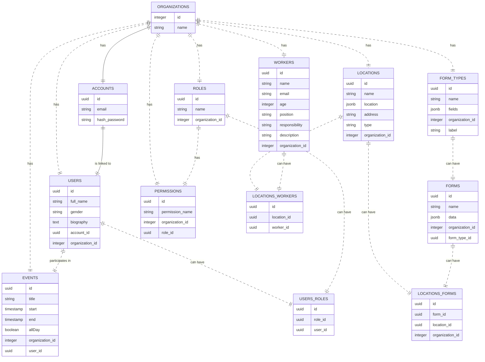

- To generate db schema and create controllers for it:
  mix phx.gen.json Accounts Account accounts email:string hash_password:string

Organizations - mix phx.gen.json Organizations Organization organizations name:string
Roles - mix phx.gen.json Roles Role roles name:string organization_id:references:organizations
Permissions - mix phx.gen.json Permissions Permission permissions permission_name:string organization_id:references:organizations role_id:references:roles
Locations - mix phx.gen.json Locations Location locations name:string location:map address:string organization_id:references:organizations
FormType - mix phx.gen.json FormTypes FormType form_types name:string fields:map organization_id:references:organizations
Forms - mix phx.gen.json Forms Form forms name:string data:map organization_id:references:organizations form_type_id:references:form_types
Workers - mix phx.gen.json Workers Worker workers name:string organization_id:references:organizations email:string age:integer position:string responsibility:string description:string

Events - mix phx.gen.json Events Event events title:string start:utc_datetime end:utc_datetime allDay:boolean organization_id:references:organizations user_id:references:users

LocationsWorker - mix ecto.gen.migration

Generate migrations - mix phx.gen.migrations

